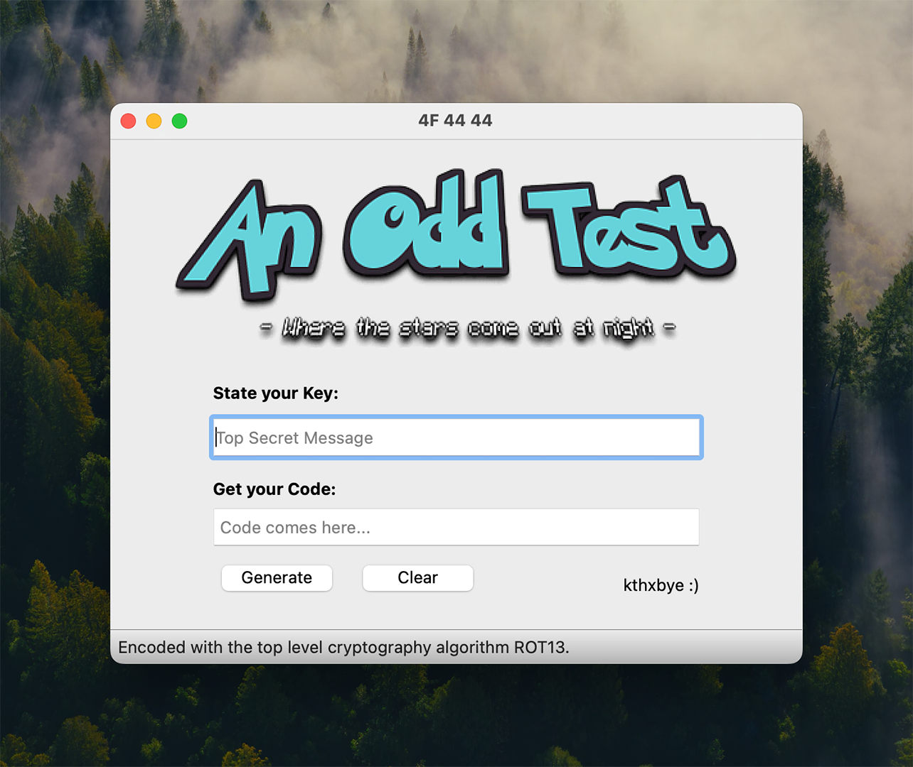
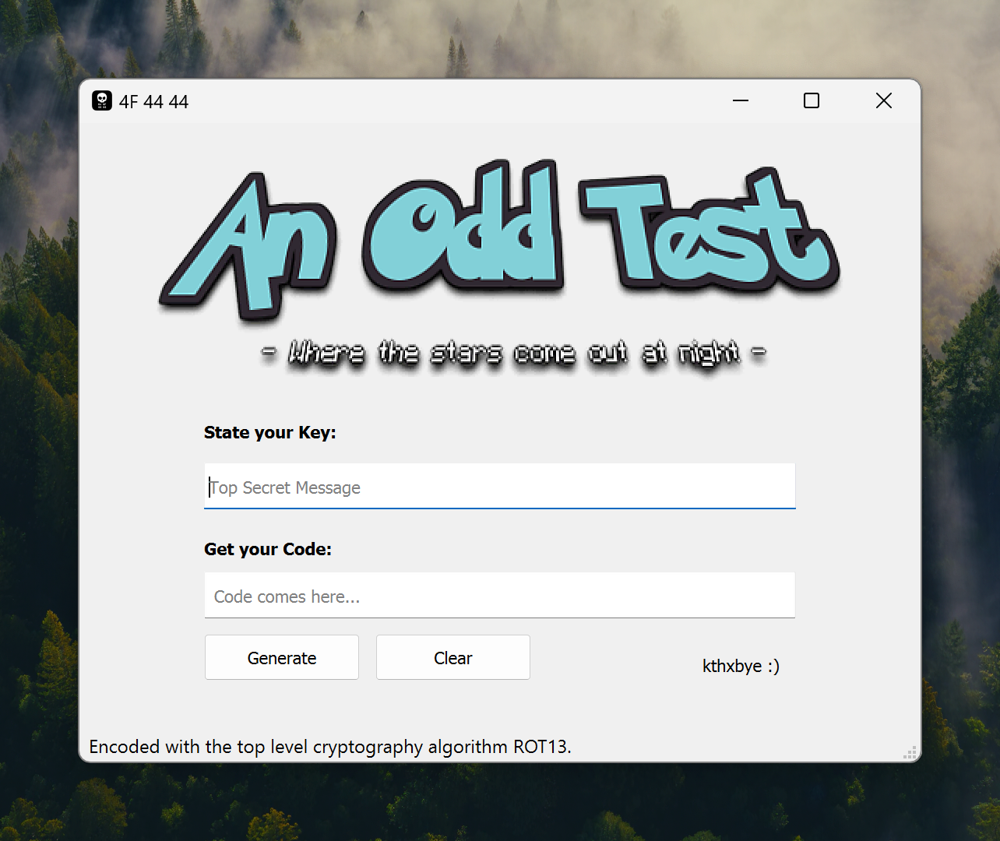

<a name="readme-top"></a>

<!-- PROJECT LOGO -->
<br />
<div align="center">
  <a href="https://github.com/oeeve">
    
  </a>
<br />
</div>


<!-- ABOUT THE PROJECT -->
## OddChipherII.exe
A Small executable based on PyQt5 (testing the native looks). Plays music and encodes secrets. // A base executable for multiple UC2DIN10 Registry tests.

|      MacOS 14    |      Windows 11           |
| :----------------------: | :-----------------------: |
|  |  |


Download the executables for quick testing:
[Windows](readme/OddChipherII.exe) | [Mac](readme/OddChipherII.app/)


<!-- Prerequisites -->
### Prerequisites

    pip intall PyQt5 pyinstaller


<!-- Building -->
### Building

Building on **Windows** _(Use an AMD machine, pyinstaller does not work in Windows VM's on ARM)_:
   ```sh
   Python PyInstaller --onefile --upx-dir=/upx422 --windowed --add-data "a.png:." --add-data "odd.png:." --add-data "b.mp3:." --icon "a.ico" OddChipherII.py
   ```

Building on **macOS** or **Linux**:
   ```sh
   pyinstaller --onefile --upx-dir=/opt/homebrew/bin/upx --windowed --add-data "a.png:." --add-data "odd.png:." --add-data "b.mp3:." --icon "a.ico" OddChipherII.py
   ```

   Tested [UPX](https://upx.github.io), but it did litte/nothing for size or startupt speed, but increased the likelihood of the .exe being flagged by windows defender. (can just be left out). (signtool and a CA certificate should be used for a proper  --onefile executable).

<p align="right">(<a href="#readme-top">back to top</a>)</p>


`Until next time...`

  <a href="https://github.com/oeeve">
    
  </a>


